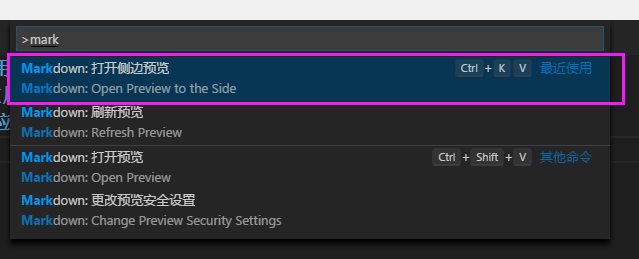
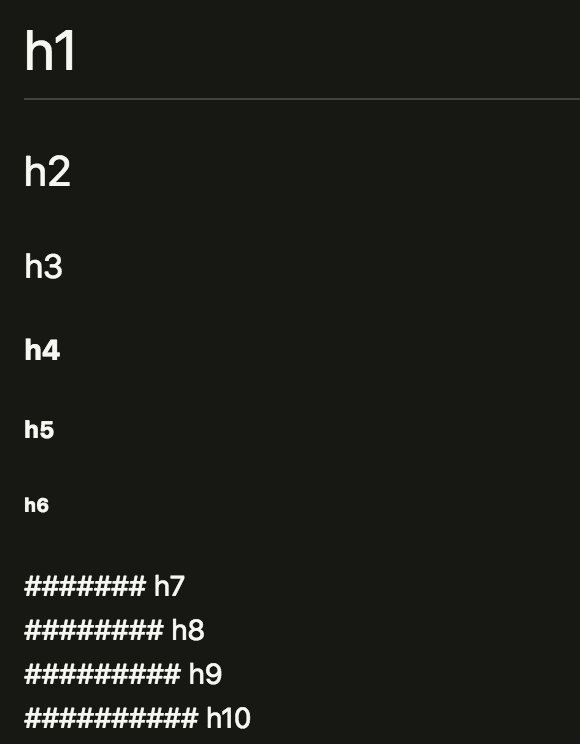
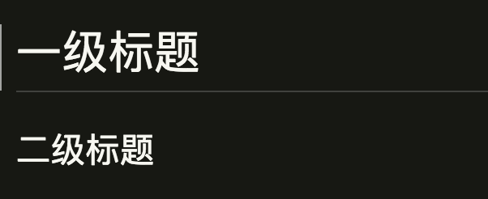

# VsCode下使用Markdown进行文档编写  

1. Windows: Ctrl + Shift + P 调出主命令框，输入     Markdown，应该会匹配到几项 Markdown相关命令

    MacOs：Shift + command + P 调出主命令框,输入Markdown,匹配Markdown常用操作

2. Windows: 先按Ctrl + K，然后放掉，紧接着再按      v，也能调出实时预览框。【要在英文输入状态下】

    MacOs：先按command + K,然后放掉，紧接着再按      v，也能调出实时预览框。【要在英文输入状态下】（该命令调出之后，容易出现无法编辑bug）

## Markdown语法：  

   ### 1.标题（只能支持6级标题）
    代码
    注：# 后面保持空格

    # h1
    ## h2
    ### h3
    #### h4
    ##### h5
    ###### h6
    ####### h7      // 错误代码
    ######## h8     // 错误代码
    ######### h9    // 错误代码
    ########## h10  // 错误代码

    演示效果

### 2.分级标题
代码  
注：= - 最少可以只写一个，兼容性一般

 一级标题 ======================  

 二级标题 ---------------------

 演示效果： 

  

