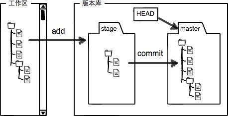
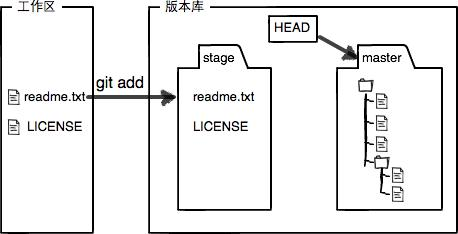
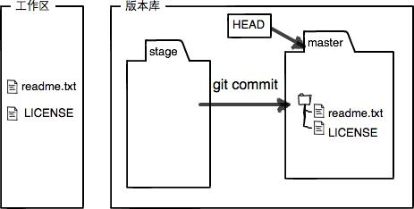

# Git简介  

创始人 linus两周时间用C语言开发的分布式版本控制软件

# 集中式VS分布式  

## 集中式

工作模式：

    1. 版本库是集中存放在中央服务器  
    2. 先从中央服务器取得最新的版本  
    3. 然后开始工作  
    4. 将最新的代码推送至服务器  
   
   弊端：
   1. 必须联网才能工作(受网速影响很大)   
   2. 集中式版本控制系统的中央服务器要是出了问题，所有人都没法干活了

## 分布式  

工作模式：
    1. 分布式版本控制系统根本没有“中央服务器”  
    2. 每个人的电脑上都是一个完整的版本库  
    3. 不需要联网  
    4. 多人协作，相互推送改动文件即可  

    优点：

    1. 分布式版本控制系统的安全性要高很多，即使中央服务器出了问题也可以从其他人那拷贝一份  
    2. 强大的分支管理系统  
    3. 也可以有一个中央服务器，方便大家相互交换数据，即使没有也不影响开发，只是相互交换不方便而已

## 其他版本控制软件 
### 免费的版本控制软件   
CVS作为最早的开源而且免费的集中式版本控制系统，由于CVS自身设计的问题，会造成提交文件不完整，版本库莫名其妙损坏的情况。同样是开源而且免费的SVN修正了CVS的一些稳定性问题，是目前用得最多的集中式版本库控制系统（之前学习java也是用的svn）。  

IBM的ClearCase（以前是Rational公司的，被IBM收购了），特点是安装比Windows还大，运行比蜗牛还慢，能用ClearCase的一般是世界500强，他们有个共同的特点是财大气粗，或者人傻钱多。  
微软自己也有一个集中式版本控制系统叫VSS，集成在Visual Studio中。由于其反人类的设计，连微软自己都不好意思用了。

分布式版本控制系统除了Git以及促使Git诞生的BitKeeper外，还有类似Git的Mercurial和Bazaar等。这些分布式版本控制系统各有特点，但最快、最简单也最流行的依然是Git！

# 安装git  

linux / Mac os/ Windows 安装都挺方便
安装完成之后：  

git config --global user.name "Your Name"  
git config --global user.email "email@example.com"  
Git是分布式版本控制系统，所以，每个机器都必须自报家门：你的名字和Email地址

# 创建版本库  
什么是版本库呢？版本库又名仓库，英文名repository，你可以简单理解成一个目录，这个目录里面的所有文件都可以被Git管理起来，每个文件的修改、删除，Git都能跟踪，以便任何时刻都可以追踪历史，或者在将来某个时刻可以“还原”。

新建或者找到指定的文件目录（Windows文件目录不要含中文)
git init  
Initialized empty Git repository in /Users/xxxx/Desktop/Learning/.git/
ls -ah命令就可以看见.git的目录  

# 把文件添加到版本库  
所有的版本控制系统，其实只能跟踪文本文件的改动，比如TXT文件，网页，所有的程序代码等等，Git也不例外。版本控制系统可以告诉你每次的改动，比如在第5行加了一个单词“Linux”，在第8行删了一个单词“Windows”。而图片、视频这些二进制文件，虽然也能由版本控制系统管理，但没法跟踪文件的变化，只能把二进制文件每次改动串起来，也就是只知道图片从100KB改成了120KB，但到底改了啥，版本控制系统不知道，也没法知道。    

不幸的是，Microsoft的Word格式是二进制格式，因此，版本控制系统是没法跟踪Word文件的改动的，前面我们举的例子只是为了演示，如果要真正使用版本控制系统，就要以纯文本方式编写文件。    

因为文本是有编码的，比如中文有常用的GBK编码，日文有Shift_JIS编码，如果没有历史遗留问题，强烈建议使用标准的UTF-8编码，所有语言使用同一种编码，既没有冲突，又被所有平台所支持。    

windows禁止使用记事本编辑文档（原因是Microsoft开发记事本的团队使用了一个非常弱智的行为来保存UTF-8编码的文件，他们自作聪明地在每个文件开头添加了0xefbbbf（十六进制）的字符，你会遇到很多不可思议的问题）    

### 第一步，用命令git add告诉Git，把文件添加到仓库：

$ git add readme.txt  
执行上面的命令，没有任何显示，这就对了，Unix的哲学是“没有消息就是好消息”，说明添加成功。  

### 第二步，用命令git commit告诉Git，把文件提交到仓库：

$ git commit -m "新增加一个readme文件"  
 [master (root-commit) abab012] 新增加一个readme文件  
 1 file changed, 2 insertions(+)  
 create mode 100644 Readme.txt  

git commit命令执行成功后会告诉你，1 file changed：1个文件被改动（我们新添加的readme.txt文件）；2 insertions：插入了两行内容（readme.txt有两行内容）。  

注：git commit 后的-m 必须写（虽然有方法可以不写）   简单明了知道文档的变动      

为什么Git添加文件需要add，commit一共两步呢？因为commit可以一次提交很多文件，所以你可以多次add不同的文件，比如：  

$ git add file1.txt
$ git add file2.txt file3.txt
$ git commit -m "add 3 files."

# 小结
现在总结一下今天学的两点内容：

初始化一个Git仓库，使用git init命令。

添加文件到Git仓库，分两步：

使用命令git add <file>，注意，可反复多次使用，添加多个文件；
使用命令git commit -m <message>，完成。

# 时光机穿梭  

修改Readme.txt内容
Git is a distributed version control system.
Git is free software.

## 运行git status  多运行git status 时刻了解git状态

$ git status  
On branch master  
Changes not staged for commit:  
  (use "git add <file>..." to update what will be committed)  
  (use "git checkout -- <file>..." to discard changes in working directory)  
  
	modified:   readme.txt  
  
no changes added to commit (use "git add" and/or "git commit -a")  

## git diff可以查看文档修改的内容

$ git diff readme.txt    
diff --git a/readme.txt b/readme.txt  
index 46d49bf..9247db6 100644  
--- a/readme.txt  
+++ b/readme.txt  
@@ -1,2 +1,2 @@  
-Git is a version control system.  
+Git is a distributed version control system.  
 Git is free software.  

之后git add Readme.txt 

然后查看git status 
$ git status  
On branch master  
Changes to be committed:  
  (use "git reset HEAD <file>..." to unstage)  
  
	modified:   readme.txt  

git status告诉我们，将要被提交的修改包括readme.txt，下一步，就可以放心地提交了：  

$ git commit -m "add distributed"  
[master e475afc] add distributed  
 1 file changed, 1 insertion(+), 1 deletion(-)  

提交后，我们再用git status命令看看仓库的当前状态：  
  
$ git status  
On branch master  
nothing to commit, working tree clean  

Git告诉我们当前没有需要提交的修改，而且，工作目录是干净（working tree clean）的。  

小结
要随时掌握工作区的状态，使用git status命令。

如果git status告诉你有文件被修改过，用git diff可以查看修改内容。

git add  
git commit -m "xxx"
git status 
随时了解情况

## 版本回退

不断修改Reamdme.txt文件
git log命令显示从最近到最远的提交日志（可以看到文本修改的详细记录)

$ git log  
commit 1094adb7b9b3807259d8cb349e7df1d4d6477073 (HEAD -> master)  
Author: Michael Liao <askxuefeng@gmail.com>  
Date:   Fri May 18 21:06:15 2018 +0800  
  
    append GPL  
  
commit e475afc93c209a690c39c13a46716e8fa000c366  
Author: Michael Liao <askxuefeng@gmail.com>  
Date:   Fri May 18 21:03:36 2018 +0800  
  
    add distributed  
  
commit eaadf4e385e865d25c48e7ca9c8395c3f7dfaef0  
Author: Michael Liao <askxuefeng@gmail.com>  
Date:   Fri May 18 20:59:18 2018 +0800  
  
    wrote a readme file  

如果嫌输出信息太多，看得眼花缭乱的，可以试试加上--pretty=oneline参数：  
  
$ git log --pretty=oneline  
1094adb7b9b3807259d8cb349e7df1d4d6477073 (HEAD -> master) append GPL  
e475afc93c209a690c39c13a46716e8fa000c366 add distributed  
eaadf4e385e865d25c48e7ca9c8395c3f7dfaef0 wrote a readme file  

你看到的一大串类似1094adb...的是commit id（版本号），和SVN不一样，Git的commit id不是1，2，3……递增的数字，而是一个SHA1计算出来的一个非常大的数字，用十六进制表示，而且你看到的commit id和我的肯定不一样，以你自己的为准。为什么commit id需要用这么一大串数字表示呢？因为Git是分布式的版本控制系统，后面我们还要研究多人在同一个版本库里工作，如果大家都用1，2，3……作为版本号，那肯定就冲突了。  
  
每提交一个新版本，实际上Git就会把它们自动串成一条时间线。如果使用可视化工具查看Git历史，就可以更清楚地看到提交历史的时间线  

我们要把当前版本append GPL回退到上一个版本add distributed，就可以使用git reset命令：  
  
$ git reset --hard HEAD^  
HEAD is now at e475afc add distributed  

在Git中，总是有后悔药可以吃的。当你用$ git reset --hard HEAD^回退到add distributed版本时，再想恢复到append GPL，就必须找到append GPL的commit id。Git提供了一个命令git reflog用来记录你的每一次命令：  
  
$ git reflog  
e475afc HEAD@{1}: reset: moving to HEAD^  
1094adb (HEAD -> master) HEAD@{2}: commit: append GPL  
e475afc HEAD@{3}: commit: add distributed  
eaadf4e HEAD@{4}: commit (initial): wrote a readme file  

小结  
现在总结一下：  
  
HEAD指向的版本就是当前版本，因此，Git允许我们在版本的历史之间穿梭，使用命令git reset --hard commit_id。  
  
穿梭前，用git log可以查看提交历史，以便确定要回退到哪个版本。  
  
要重返未来，用git reflog查看命令历史，以便确定要回到未来的哪个版本。  

# 工作区和暂存区  

Git和其他版本控制系统如SVN的一个不同之处就是有暂存区的概念。

## 工作区  

就是你在电脑里能看到的目录，比如我的learngit文件夹就是一个工作区（本地环境的文件目录就是工作区）:

## 版本库（Repository）  

工作区有一个隐藏目录.git，这个不算工作区，而是Git的版本库。  
Git的版本库里存了很多东西，其中最重要的就是称为stage（或者叫index）的暂存区，还有Git为我们自动创建的第一个分支master，以及指向master的一个指针叫HEAD  
  

我们把文件往Git版本库里添加的时候，是分两步执行的：  

第一步是用git add把文件添加进去，实际上就是把文件修改添加到暂存区；  

第二步是用git commit提交更改，实际上就是把暂存区的所有内容提交到当前分支。  

因为我们创建Git版本库时，Git自动为我们创建了唯一一个master分支，所以，现在，git commit就是往master分支上提交更改。  

你可以简单理解为，需要提交的文件修改通通放到暂存区，然后，一次性提交暂存区的所有修改。  

先对readme.txt做个修改，比如加上一行内容：  

Git is a distributed version control system.  
Git is free software distributed under the GPL.  
Git has a mutable index called stage.  
然后，在工作区新增一个LICENSE文本文件（内容随便写）。  
  
先用git status查看一下状态：  
  
$ git status  
On branch master  
Changes not staged for commit:  
  (use "git add <file>..." to update what will be committed)  
  (use "git checkout -- <file>..." to discard changes in working directory)  

	modified:   readme.txt  

Untracked files:  
  (use "git add <file>..." to include in what will be committed)  

	LICENSE  
  
no changes added to commit (use "git add" and/or "git commit -a")  

现在，使用两次命令git add，把readme.txt和LICENSE都添加后，用git status再查看一下：  
  
$ git status  
On branch master  
Changes to be committed:  
  (use "git reset HEAD <file>..." to unstage)  
  
	new file:   LICENSE  
	modified:   readme.txt  

现在，暂存区的状态就变成这样了：  

  

所以，git add命令实际上就是把要提交的所有修改放到暂存区（Stage），然后，执行git commit就可以一次性把暂存区的所有修改提交到分支。  

$ git commit -m "understand how stage works"  
[master e43a48b] understand how stage works  
 2 files changed, 2 insertions(+)  
 create mode 100644 LICENSE  

 一旦提交后，如果你又没有对工作区做任何修改，那么工作区就是“干净”的：  

 $ git status  
On branch master  
nothing to commit, working tree clean  

现在版本库变成了这样，暂存区就没有任何内容了：  

  

小结  
暂存区是Git非常重要的概念，弄明白了暂存区，就弄明白了Git的很多操作到底干了什么。  

# 管理修改  

为什么Git比其他版本控制系统设计得优秀，因为Git跟踪并管理的是修改，而非文件。  

你会问，什么是修改？比如你新增了一行，这就是一个修改，删除了一行，也是一个修改，更改了某些字符，也是一个修改，删了一些又加了一些，也是一个修改，甚至创建一个新文件，也算一个修改。  

为什么说Git管理的是修改，而不是文件呢？我们还是做实验。第一步，对readme.txt做一个修改，比如加一行内容：  

$ cat readme.txt  
Git is a distributed version control system.  
Git is free software distributed under the GPL.  
Git has a mutable index called stage.  
Git tracks changes.  

git add 之后查看状态  

$ git add readme.txt   
$ git status    
 On branch master  
 Changes to be committed:  
   (use "git reset HEAD <file>..." to unstage)  
  
       modified:   readme.txt  

$ git commit -m "git tracks changes"
[master 519219b] git tracks changes
 1 file changed, 1 insertion(+)  

提交后，再看看状态：  

$ git status  
On branch master  
Changes not staged for commit:  
  (use "git add <file>..." to update what will be committed)  
  (use "git checkout -- <file>..." to discard changes in working directory)  
  
	modified:   readme.txt  
  
no changes added to commit (use "git add" and/or "git commit -a")  

Git管理的是修改，当你用git add命令后，在工作区的第一次修改被放入暂存区，准备提交，但是，在工作区的第二次修改并没有放入暂存区，所以，git commit只负责把暂存区的修改提交了，也就是第一次的修改被提交了，第二次的修改不会被提交。  

提交后，用git diff HEAD -- readme.txt命令可以查看工作区和版本库里面最新版本的区别：  

$ git diff HEAD -- readme.txt   
diff --git a/readme.txt b/readme.txt  
index 76d770f..a9c5755 100644  
--- a/readme.txt  
+++ b/readme.txt  
@@ -1,4 +1,4 @@  
 Git is a distributed version control system.  
 Git is free software distributed under the GPL.  
 Git has a mutable index called stage.  
-Git tracks changes.  
+Git tracks changes of files.  

小结：  
每次修改，如果不用git add到暂存区，那就不会加入到commit中。

# 撤销修改  

在readme.txt中添加了一行：  

$ cat readme.txt  
Git is a distributed version control system.  
Git is free software distributed under the GPL.  
Git has a mutable index called stage.  
Git tracks changes of files.  
My stupid boss still prefers SVN.  

可以删掉最后一行，手动把文件恢复到上一个版本的状态。如果用git status查看一下：  

$ git status  
On branch master  
Changes not staged for commit:  
  (use "git add <file>..." to update what will be committed)  
  (use "git checkout -- <file>..." to discard changes in working directory)  
  
	modified:   readme.txt  
  
no changes added to commit (use "git add" and/or "git commit -a")  

现在版本未发现 git checkout命令  
新版命令应该是git restore --staged +文件名  直接清空工作区  

Git会告诉你，git checkout -- file可以丢弃工作区的修改：  

$ git checkout -- readme.txt  
命令git checkout -- readme.txt意思就是，把readme.txt文件在工作区的修改全部撤销，这里有两种情况：  

一种是readme.txt自修改后还没有被放到暂存区，现在，撤销修改就回到和版本库一模一样的状态；  

一种是readme.txt已经添加到暂存区后，又作了修改，现在，撤销修改就回到添加到暂存区后的状态。  

总之，就是让这个文件回到最近一次git commit或git add时的状态。  

现在，看看readme.txt的文件内容：  

$ cat readme.txt  
Git is a distributed version control system.  
Git is free software distributed under the GPL.  
Git has a mutable index called stage.  
Git tracks changes of files.  

文件内容果然复原了。  
  
git checkout -- file命令中的--很重要，没有--，就变成了“切换到另一个分支”的命令，我们在后面的分支管理中会再次遇到git checkout命令。  

git checkout命令应该是比较容易造成混乱  所以弃用了

小结  
又到了小结时间。  

场景1：当你改乱了工作区某个文件的内容，想直接丢弃工作区的修改时，用命令git checkout -- file。  

场景2：当你不但改乱了工作区某个文件的内容，还添加到了暂存区时，想丢弃修改，分两步，第一步用命令git reset HEAD <file>，就回到了场景1，第二步按场景1操作。  

场景3：已经提交了不合适的修改到版本库时，想要撤销本次提交，参考版本回退一节，不过前提是没有推送到远程库。  

# 删除文件

在Git中，删除也是一个修改操作，我们实战一下，先添加一个新文件test.txt到Git并且提交：  

$ git add test.txt  

$ git commit -m "add test.txt"  
[master b84166e] add test.txt  
 1 file changed, 1 insertion(+)  
 create mode 100644 test.txt  

# 本地关联两个远程仓库
  
       
