# 2019-12-09

## 题目1：
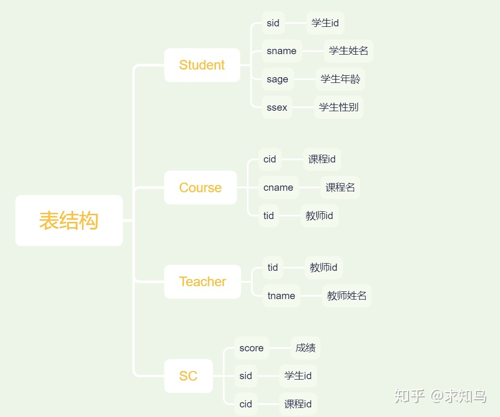

建表语句如下：

```
create table Student(sid varchar(10),sname varchar(10),sage varchar(10),ssex varchar(10));
-- 存储学生基本信息
insert into Student values('01' , '赵雷' , '1990-01-01' , '男');
insert into Student values('02' , '钱电' , '1990-12-21' , '男');
insert into Student values('03' , '孙风' , '1990-05-20' , '男');
insert into Student values('04' , '李云' , '1990-08-06' , '男');
insert into Student values('05' , '周梅' , '1991-12-01' , '女');
insert into Student values('06' , '吴兰' , '1992-03-01' , '女');
insert into Student values('07' , '郑竹' , '1989-07-01' , '女');
insert into Student values('08' , '王菊' , '1990-01-20' , '女');

-- 存储课程和老师ID的对应关系
create table Course(cid varchar(10),cname varchar(10),tid varchar(10));
insert into Course values('01' , '语文' , '02');
insert into Course values('02' , '数学' , '01');
insert into Course values('03' , '英语' , '03');

create table Teacher(tid varchar(10),tname varchar(10));
insert into Teacher values('01' , '张三');
insert into Teacher values('02' , '李四');
insert into Teacher values('03' , '王五');

create table SC(sid varchar(10),cid varchar(10),score decimal(18,1));
insert into SC values('01' , '01' , 80);
insert into SC values('01' , '02' , 90);
insert into SC values('01' , '03' , 99);
insert into SC values('02' , '01' , 70);
insert into SC values('02' , '02' , 60);
insert into SC values('02' , '03' , 80);
insert into SC values('03' , '01' , 80);
insert into SC values('03' , '02' , 80);
insert into SC values('03' , '03' , 80);
insert into SC values('04' , '01' , 50);
insert into SC values('04' , '02' , 30);
insert into SC values('04' , '03' , 20);
insert into SC values('05' , '01' , 76);
insert into SC values('05' , '02' , 87);
insert into SC values('06' , '01' , 31);
insert into SC values('06' , '03' , 34);
insert into SC values('07' , '02' , 89);
insert into SC values('07' , '03' , 98);
```
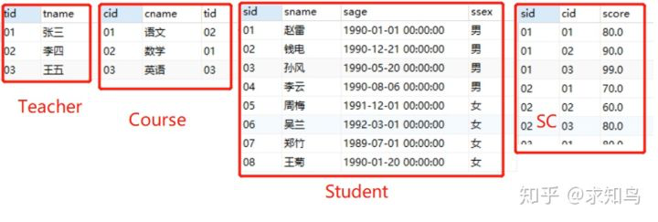


[疑难问题(mysql建表之后无法插入中文汉字内容)](/SQL学习/SQL疑难问题/001mysql无法插入汉字.md)  


### 1、查询"01"课程比"02"课程成绩高的学生的信息及课程分数

* 方法1：
```
-- --查询"01"课程比"02"课程成绩高的信息；注意加上02成绩（有where）
select 
stu.sid as "学号ID",
stu.sname as "学生姓名",
stu.sage as "出生年月",
stu.ssex as "性别",
c01.score as "学科1分数",
c02.score as "学科2分数"
from
(select * from sc where cid = '01') c01   -- 首先筛选出01课程的所有信息
left join (select * from sc where cid = '02') c02 on c01.sid = c02.sid -- 然后筛选出02课程的所有信息  通过学员ID把他们关联起来  相当于VLOOKUP  
                                                                        -- 因为他题目要求是课程01比课程02成绩高 所以以课程01的成绩为主表
left join Student stu on stu.sid = c01.sid  -- 关联学生基本信息
where c01.score > c02.score    -- 限制条件为01课程成绩比02成绩高 大于

思考的点：1. 必须使用left join或者inner join么  
        2. 数值可以和空值进行比较么


```

* 方法2

```
暂无   没想到更好的方法

```

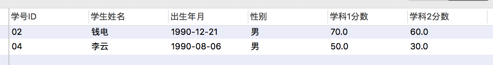

### 2、查询同时存在01和02课程的情况（即一个人同时学习两门课程）

* 方法1
```
-- --查询既有"01"课程又有"02"课程成绩，不考虑这两个成绩的关系
select 
stu.sid as "学号ID",
stu.sname as "学生姓名",
stu.sage as "出生年月",
stu.ssex as "性别",
c01.score as "学科1分数",
c02.score as "学科2分数"
from
(select * from sc where cid = '01') c01   -- 首先筛选出01课程的所有信息
inner join (select * from sc where cid = '02') c02 on c01.sid = c02.sid -- 然后筛选出02课程的所有信息  通过学员ID把他们关联起来  相当于VLOOKUP  
                                                                        -- 因为他题目要求是课程01比课程02成绩高 所以以课程01的成绩为主表
left join Student stu on stu.sid = c01.sid  -- 关联学生基本信息
 

```
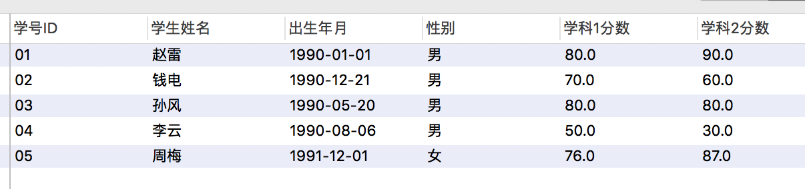

* 方法2（该方法无法展示课程01和课程02的成绩）

```
select 
stu.sid as "学号ID",
stu.sname as "学生姓名",
stu.sage as "出生年月",
stu.ssex as "性别",
st.num as "课程数",
case when st.num = 2 then '符合' else '不符合' end as "是否符合既有课程01,又有课程02"
from
(select sid,count(*) as num,count(distinct cid) as num1
from sc 
where cid = '01'
or cid = '02'
group by 1 
having count(*) = 2     -- 可以注释下这个看下是否符合既有课程01,又有课程02字段的展示效果 
) st                    -- 找到有课程01 或者有课程02  然后判断课程数量为2(课程可以去重)  即既有课程01 又有课程02的同学
left join Student stu on stu.sid = st.sid  -- 关联学生基本信息

```
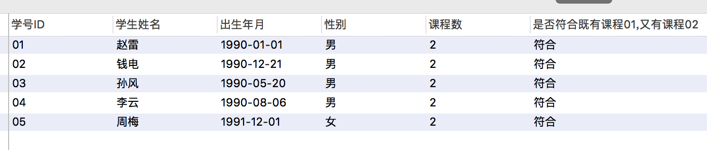


* 方法3

```
使用rown_number() over(partition by ) 函数将学生学习的01 02课程排名  有等于2的即学习了两门课程 
mysql 暂时不支持

```

* 方法4

    可以使用in 或者 exists方法解决

### 3、查询选择了02课程但没有01课程的情况（没有说明课程03的情况要不要，运营需求的精髓，需求不明确，有发挥空间）

* 方法1
```
 SELECT *
 FROM SC
 WHERE SC.sid NOT IN (   --  not in 没有选择  不在选择之中
     SELECT sid 
     FROM SC 
     WHERE SC.cid = '01'  -- 筛选出选择了课程1的学生
     )
 AND SC.cid = '02'  
```

* 方法2  （exists 返回一个布尔类型的值  True\False) 强行使用exists 
```
select *
from sc as b
where exists (select * 
	      from sc as a 
              where a.sid not in (select sid 
				 from sc 
				  where cid = '01'
			)
		and a.sid = b.sid
	)

```

结果如图：  
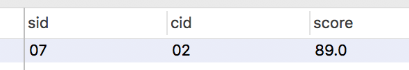

* 另外一种解答:


> 方法1: 没有选择课程01的为主表  通过学员编号该关联选择课程02的信息  因为通过学员编号 不能保持唯一 所以会有一个学员选择多门课程的情况

```

select ti1.*,ti2.score as score1 
from 
(
    select * 
    from SC
    where cid <>'01'
)ti1
inner join 
    (select * 
    from SC 
    where cid='02'
    )ti2 on ti1.sid=ti2.sid

```

> 方法2：方法1和方法2的区别在于谁做主表，因为是inner join 所以谁做主表无所谓了 如果是其他join 需要注意
> 个人认为方法2 更容易理解：先筛选出选择课程02的同学 然后筛选出没选择课程01的同学   通过学员ID进行关联

```
select ti1.*,ti2.score as score1 
from 
(
    select * 
    from SC
    where cid = '02'
)ti1
inner join 
    (select * 
    from SC 
    where cid <> '01'
    )ti2 on ti1.sid=ti2.sid

```
结果如图：  
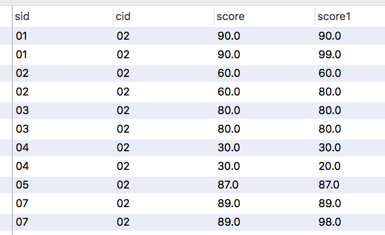


### 4、查询平均成绩大于等于60分的同学的学生编号和学生姓名和平均成绩

* 方法1：

```
select 
sc.sid as "学员编号",
st.sname as "学员姓名",
avg(score) as "平均分数"
from sc
left join Student st on st.sid = sc.sid
group by 1,2 
having avg(score) > 60

```

* 方法2：
  
```
select 
sc.sid as "学员编号",
st.sname as "学员姓名",
avg_score as "平均分数"
from (
    select sid,sname 
    from Student
) st
inner join (
    select sid,avg(score) as avg_score 
    from SC
    group by sid  
    having avg(score)>=60
    ) sc on sc.sid = st.sid
group by sc.sid,st.sname

```

* 方法3    
     
  使用分析函数 avg() over()  
  此题可以扩展下 显示每个学员各科成绩以及对应的平均成绩，总成绩，以及考试科目的数量  


> 方法1和方法2 对比优选方法1
> > 代码量   方法1代码量更少  
> > 业务理解    方法1代表你通过对业务的理解可以优化代码  
> > 思维方式    因为你知道关联学生信息更单独求均值是在同一个维度  

结果如图：  
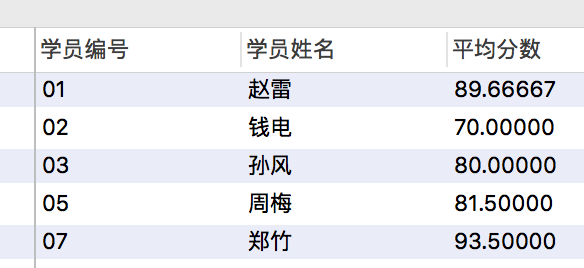 


### 5、查询在SC表存在成绩的学生信息（运营表述：查询有考试成绩的学员信息）

* 方法1

```
select distinct t2.*
from (
select * 
from SC
)t1
inner join (
    select * 
    from Student
    )t2 on t1.sid=t2.sid;

```
* 方法2

```
select * 
from Student
where sid in (select distinct sid
              from sc)
```

* 方法3

```
select *
from Student as st
where exists (select * 
              from sc 
              where sc.sid = st.sid
              )

```

> 复习下exists跟in的区别  一个内表  一个外表  

结果如图：(没有显示sid=08的学员信息，因为他没有成绩)
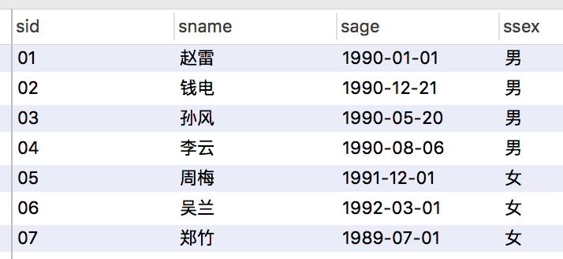

### 6、查询所有同学的学生编号、学生姓名、选课总数、所有课程的成绩总和

> 注意需求，是所有同学的  注意主表  

* 方法1

```
select 
st.sid as "学员编号",
st.sname as "学员姓名",
count(distinct sc.cid) as "选课总数",
sum(score) as "平均分数"
from Student st 
left join sc on st.sid = sc.sid
group by 1,2 
 
```

知识点：  1. count会不会计算null
         2. 要判断谁做主表

* 方法2

```
count() over()
sum() over()

```

结果如图:  
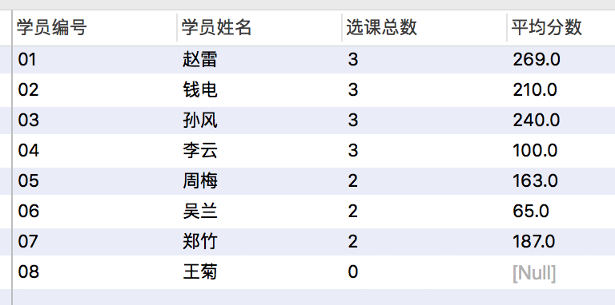

### 7、查询没有学全所有课程的同学的信息

知识点
> 1. 怎么判断全部课程（课程数量、课程ID)
> 2. 没有学全怎么限制

* 方法1  

```
select 
st.sid as "学员编号",
st.sname as "学员姓名",
count(distinct sc.cid) as "选课总数",
(select count(distinct cid) from sc) as "所有课程数量"
from Student st 
left join sc on st.sid = sc.sid
group by 1,2 
having count(distinct sc.cid) < (select count(distinct cid) from sc)

```

* 方法2

> 该方法这么处理，显然已经知道一共3门课程

```
select sid,sname 
from Student
where sid not in (  select sid 
                    from SC 
                    group by sid  
                    having count(distinct cid)=3
)

```

* 方法3

```


```


>mysql中，where后可以跟子查询，却不能跟聚合函数！但having后可以跟聚合函数，同时可以加子查询！

> 上面方法1的脚本中如果把left join 改为inner join 就会减少一条数据 思考为是什么 
> 因为有一个人一科成绩也没有  他没有参加考试    


结果如图：
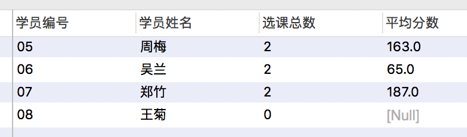


### 8、查询至少有一门课与学号为" 01 "的同学所学相同的同学的信息

> 1. 需要先确定01同学都学了哪些课程
> 2. 再看下这些课程都有哪些同学参加即可
> 3. 然后关联学生基本信息表

```


```